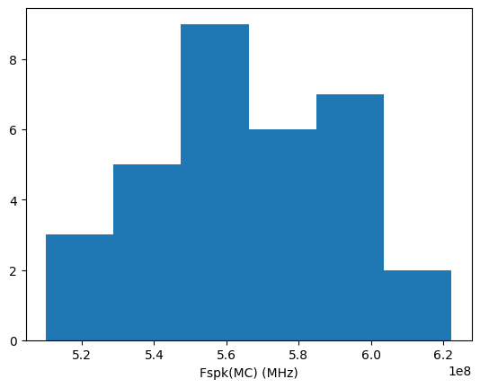

# CACE Summary for LIF_neuron

**netlist source**: schematic

|      Parameter       |         Tool         |     Result      | Min Limit  |  Min Value   | Typ Target |  Typ Value   | Max Limit  |  Max Value   |  Status  |
| :------------------- | :------------------- | :-------------- | ---------: | -----------: | ---------: | -----------: | ---------: | -----------: | :------: |
| Fspk(PVT)            | ngspice              | Fspk                 |             any | 385.690 MHz |          any | 539.894 MHz |          any | 802.087 MHz |   Pass ✅    |
| Iavg(PVT)            | ngspice              | Iavg                 |             any |   0.901 mA |          any |   1.513 mA |          any |   2.566 mA |   Pass ✅    |
| Pavg(PVT)            | ngspice              | Pavg                 |             any |   0.973 mW |          any |   1.820 mW |          any |   3.388 mW |   Pass ✅    |
| Espk(PVT)            | ngspice              | Espk                 |             any |   2.244 pJ |          any |   3.222 pJ |          any |   5.425 pJ |   Pass ✅    |
| Fspk(MC)             | ngspice              | Fspk                 |             any | 510.112 MHz |          any | 562.366 MHz |          any | 622.181 MHz |   Pass ✅    |
| Iavg(MC)             | ngspice              | Iavg                 |             any |   1.443 mA |          any |   1.563 mA |          any |   1.734 mA |   Pass ✅    |
| Pavg(MC)             | ngspice              | Pavg                 |             any |   1.731 mW |          any |   1.875 mW |          any |   2.081 mW |   Pass ✅    |
| Espk(MC)             | ngspice              | Espk                 |             any |   3.061 pJ |          any |   3.353 pJ |          any |   3.716 pJ |   Pass ✅    |
| Area                 | magic_area           | area                 |               ​ |          ​ |            ​ |          ​ |          any |          ​ |   Skip 🟧    |
| Width                | magic_area           | width                |               ​ |          ​ |            ​ |          ​ |          any |          ​ |   Skip 🟧    |
| Height               | magic_area           | height               |               ​ |          ​ |            ​ |          ​ |          any |          ​ |   Skip 🟧    |
| Magic DRC            | magic_drc            | drc_errors           |               ​ |          ​ |            ​ |          ​ |            0 |          ​ |   Skip 🟧    |
| KLayout DRC full     | klayout_drc          | drc_errors           |               ​ |          ​ |            ​ |          ​ |            0 |          ​ |   Skip 🟧    |

## Plots

## Fout_mc

